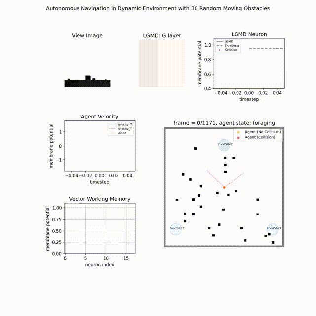

### An insect-inspired model facilitating autonomous navigation by incorporating __goal approaching__ and __collision avoidance__

[Sun, X., Fu, Q., Peng, J., & Yue, S. (2023). An insect-inspired model facilitating autonomous navigation by incorporating goal approaching and collision avoidance. Neural Networks, 165, 106-118.](https://doi.org/10.1016/j.neunet.2023.05.033)

#### 1. Performance
two demos of agent's navigating in static and dynamic environment:
 |  
---|---

#### 2. Files
```
project
│   README.md
|   demo1.gif
|   demo2.gif
│
└───simulations
|     models.py: implementation of the goal approaching - path integration model (Stone et.al 2017), the collision avoidance - LGMD model (Yue and Rind, 2006) etc.
|     agent.py: combine the PI and LGMD to have the autonomous navigation model
|     plotter.py: some functions for plotting
|     runner.py: run trails of simulations
|     navigation_run_with_visulization.py: run the simulation with dynamically updated animation
|     visualization: generate video of animation / display the results by stored data containing 
│   │
│   └───worlds:contains the data of the simulated 3D world consists of static/dynamic obstactles
│       └───3FoodS200_Random: randomly moving obstacles
│       └───3FoodS200_Trans: tanslationally moving obstacles
│   
└───results
    └───simulation_navigation
    └───simulation_navigation_lgmd_no_enhancement
    └───simulation_navigation_random_obs
    └───simulation_navigation_varied_contrast
```
#### 3. Run simulation:

+ run the navigation_run_with_visulization.py in the simulations folder to run the simulation with corresponding visulization
change the world you want to use by altering this line:
```python
data_filename = '../results/simulation_navigation_random_obs/{}Obs_T1000/LGMD/1.mat'.format(num_obstacles)
```
+ run runner.py in the simulations folder to run several trials of experiments automatically:
```python
if __name__ == "__main__":
    run_dynamic_lgmd_no_enhance(0, 15, range(6, 48, 6))
```


